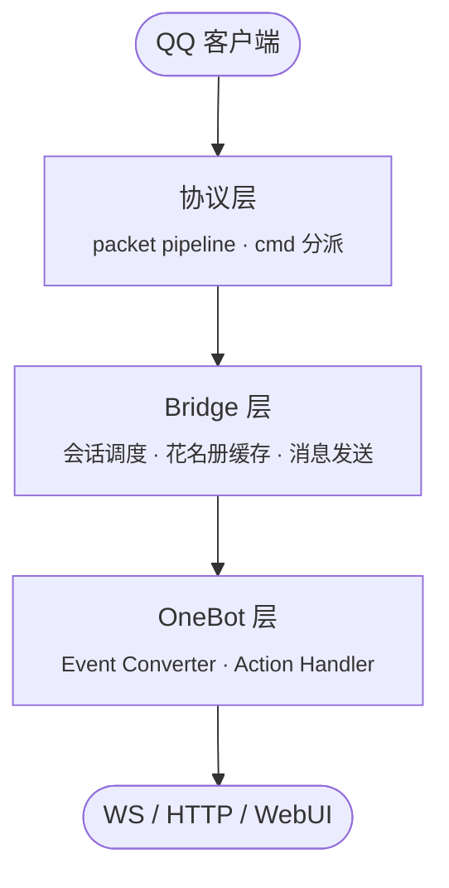

<h1 align="center">❄️ SnowLuma</h1>

<p align="center">
  <i>Next Remote Protocol Framework.</i>
</p>

<p align="center">
  <a href="https://github.com/SnowLuma/SnowLuma/releases"></a>
  <a href="https://github.com/SnowLuma/SnowLuma/actions"></a>
  <a href="https://www.npmjs.com/package/@snowluma/sdk"></a>
  <a href="https://www.npmjs.com/package/@snowluma/ui"></a>
  <a href="https://github.com/SnowLuma/SnowLuma/stargazers"></a>
</p>

<p align="center">
  <a href="https://github.com/SnowLuma/SnowLuma/releases">Releases</a> ·
  <a href="https://github.com/SnowLuma/SnowLuma/issues">Issues</a> ·
  <a href="https://qm.qq.com/q/g3UMLpWALe">QQ 群</a> ·
  <a href="https://t.me/napcatqq">Telegram</a>
</p>

---

## 简介

SnowLuma 在 QQ 客户端与生态侧之间承担协议转换工作，向上以 [OneBot v11](https://github.com/botuniverse/onebot-11) 标准协议暴露能力。Bridge 层负责会话与事件枢纽，再通过 WebSocket / HTTP / WebUI 等多种适配器对外提供接入。

项目持续迭代中，稳定版本通过 [Releases](https://github.com/SnowLuma/SnowLuma/releases) 发布。

## 特性

- **OneBot v11 兼容** —— 涵盖文本、图片、视频、语音、合并转发、戳一戳、Markdown、JSON、XML 等常用消息段。
- **多账号并行** —— 同一进程可同时托管多个 QQ 账号，会话彼此独立。
- **多种适配器** —— WebSocket Server / WebSocket Client / HTTP Server / HTTP Post，HTTP 服务端同时支持 `application/json` 与 `application/x-www-form-urlencoded`。
- **WebUI 管理面板** —— 浏览器登录、密码强度校验、登录限流、SSE 实时日志、配置热更新。
- **TypeScript 全链路** —— Bridge / OneBot / SDK / UI 均使用 TypeScript，发布到 npm 的 `@snowluma/sdk` 与 `@snowluma/ui` 可直接供下游应用消费。
- **数据持久化** —— 好友、群、群成员等关系数据落 SQLite，跨重启可用。

## 快速开始

下载预构建发布包：

```bash
# 从 Releases 下载 zip，解压到任意目录
./launcher.bat        # Windows
```

或从源码开发：

```bash
git clone https://github.com/SnowLuma/SnowLuma.git
cd SnowLuma
pnpm install
pnpm build
pnpm start
```

WebUI 默认监听 `5099` 端口。首次启动会在控制台打印 `initial credentials: user=admin password=<...>`，登录后请立即修改。
若未完成首次改密就关闭进程，下次启动会自动重新生成一个新的随机密码。

## 工作区

本仓库使用 pnpm monorepo 管理，各包职责如下：

| 包 | 说明 |
| --- | --- |
| [`@snowluma/core`](packages/core) | 核心：协议层 / Bridge / OneBot / WebUI 全部在此。 |
| [`@snowluma/sdk`](packages/sdk) | OneBot HTTP & WebSocket TypeScript SDK，发布到 npm。 |
| [`@snowluma/ui`](packages/ui) | Tailwind 4 共享组件库（shadcn 风格），发布到 npm。 |
| [`@snowluma/websocket`](packages/websocket) | OneBot WebSocket 适配器底层。 |
| [`@snowluma/proton`](packages/proton) | 编译期 protobuf 编/解码器生成器：TS interface 标注 `pb<N, T>`，Vite 插件在构建时把 `protobuf_encode<T>` / `protobuf_decode<T>` 替换为内联 codec，零运行时反射。 |
| [`@snowluma/runtime`](packages/runtime) | 运行时清单与发布包资源。 |
| [`webui`](packages/webui) | Web 管理面板前端。 |

## 架构



## 文档

- [路线图](RoadMap.md)
- [贡献指南](CONTRIBUTING.md)
- [行为准则](CODE_OF_CONDUCT.md)

## 开发命令

```bash
pnpm dev          # 启动 core dev server
pnpm dev:web      # 启动 webui dev server
pnpm test         # 运行 core 测试
pnpm typecheck    # 全仓库 type check
pnpm build:all    # 构建 core + sdk + webui
```

## 鸣谢

- [LagrangeV2](https://github.com/LagrangeDev/LagrangeV2) —— Proto 定义参考。
- [NapCatQQ](https://github.com/NapNeko/NapCatQQ) —— Scanner 与 Packet 处理实现参考。

## 贡献者

感谢每一位为 SnowLuma 提交过代码的伙伴。

<a href="https://github.com/SnowLuma/SnowLuma/graphs/contributors">
  
</a>

## Star 趋势

<a href="https://star-history.com/#SnowLuma/SnowLuma&Date">
  <picture>
    <source media="(prefers-color-scheme: dark)" srcset="https://api.star-history.com/svg?repos=SnowLuma/SnowLuma&type=Date&theme=dark" />
    <source media="(prefers-color-scheme: light)" srcset="https://api.star-history.com/svg?repos=SnowLuma/SnowLuma&type=Date" />
    
  </picture>
</a>

## 社区

- QQ 群：[SnowLuma-QQ](https://qm.qq.com/q/g3UMLpWALe)
- Telegram：[SnowLuma-TG](https://t.me/napcatqq)
- 问题反馈：[GitHub Issues](https://github.com/SnowLuma/SnowLuma/issues)
